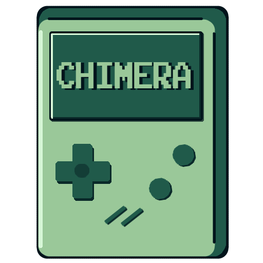

<p align="center">
  <a href=" rel="noopener">
    
  </a>
</p>

## 📝 Table of Contents
- [Description](#description)
- [Getting Started](#start)
- [Built Using](#built_using)
- [Authors](#authors)
- [Presentation and Documentation](#documentation)

## 📖 Description <a name="description"></a>
*Mickey is a classical gameboy styled game. It's story takes place in a world where dog shelters make the unwanted animals into delivery employees. Our main character Mickey, has forgot his old owner, but he gets his memory back after exploring the old town he used to be in while working. In the game you have to go through some obstacles and deliver packages to every client. That's where he meets him.*

## Getting Started <a name="start"></a>
*These instructions will get you a copy of the project up and running on your local machine.*

**Compile from source:**

1.Prerequisites - 
*Visual Studio with C++ development and Git installed.*

2.Installing

Clone the repo

```cpp
git clone https://github.com/codingburgas/2122-the-games--adventures-chimera.git
```

Open the .sln file and run the project!

## 💻 Built Using <a name="built_using"></a>
- [Visual Studio](https://visualstudio.microsoft.com/) - Application
- [Visual Studio Code](https://code.visualstudio.com/) - Website
- [Word](https://www.microsoft.com/en-us/microsoft-365/word) - Documentation
- [PowerPoint](https://www.microsoft.com/en-us/microsoft-365/powerpoint) - Presentation
- [Excel](https://www.microsoft.com/en-us/microsoft-365/excel) - QA Documentation
- [Krita](https://krita.org/en/) - Game graphics and logo


## 👥 Authors <a name="authors"></a>
- [Hristo Kovachev](https://github.com/HPKovachev19) - Scrum Trainer
- [Yoan Gavrilov](https://github.com/YAGavrilov19) - QA Engineer
- [Konstantin Dinev](https://github.com/KKDinev20) - Back-End Developer
- [Hristiyan Petrov](https://github.com/HMPetrov20) - Back-End Developer
- [Galya Ivanova](https://github.com/GAIvanova20) - Back-End Developer
- [Valeria Chavdarova](https://github.com/VDChavdarova21) - Front-End Developer
- [Teodora Lozeva](https://github.com/TLLozeva21) - Front-End Developer

## 📋 Presentation and Documentation <a name="documentation"></a>
- [Presentation](https://github.com/codingburgas/2122-the-games--adventures-chimera/tree/main/Documents)

